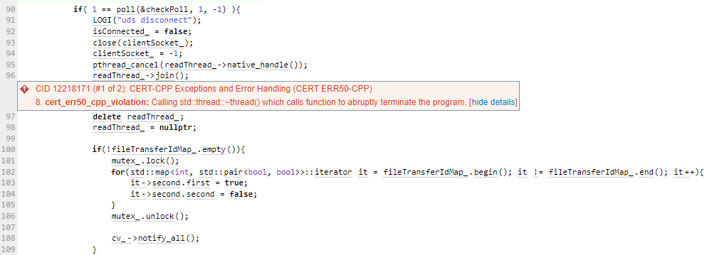
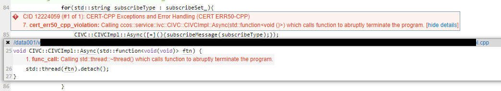
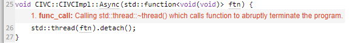

# Secure Code issue fix
## issue 1

### issue 항목 : CERT ERR50 CPP (12218171)
https://wiki.sei.cmu.edu/confluence/display/cplusplus/ERR50-CPP.+Do+not+abruptly+terminate+the+program
> - When the destructor is invoked on an object of type std::thread that refers to a joinable thread ([thread.thread.destr], paragraph 1) <br/>
조인 가능한 스레드([thread.thread.destr], paragraph 1)를 참조하는 std::thread 유형의 객체에서 소멸자가 호출될 때
> - When the copy assignment operator is invoked on an object of type std::thread that refers to a joinable thread ([thread.thread.assign], paragraph 1) <br/>
조인 가능한 스레드를 참조하는 std::thread 유형의 개체에서 복사 할당 연산자가 호출될 때

##### 나의 생각: 이미 96 line 에서 join이 되었으므로 CERT ERR50 CPP이슈가 아니라고 생각되나, 회사 System에서 이슈라고 했으므로 하기와 같이 joinable을 추가한다.
```cpp
readThread_->join();
if(readThread_->joinable())
{
    delete readThread_;
    readThread_ = nullptr;
}
```
## issue 2

### issue 항목 : CERT ERR50 CPP (12224059)
https://wiki.sei.cmu.edu/confluence/display/cplusplus/ERR50-CPP.+Do+not+abruptly+terminate+the+program

##### 나의 생각: 기존 구현자는 line25 부분에 왜 불안정한 Async() 함수를 직접 만들어 사용했는지 잘 모르겠다. c+11이후의 Async()함수를 사용했으면 이런 문제가 없을텐데. 굳이 비동기 처리가 필요해 보이지 않으므로 async부분을 제거한다.

```cpp
for(std::string subscribeType : subscribeSet_){
    subscribeMessage(subscribeType);
}
```

## issue 3

### issue 항목 : CERT ERR50 CPP (12336882)
https://wiki.sei.cmu.edu/confluence/display/cplusplus/ERR50-CPP.+Do+not+abruptly+terminate+the+program
##### 나의 생각: Async()를 직접 구현한 부분을 std::async()으로 변경하자
> https://en.cppreference.com/w/cpp/thread/async <br/>
> The result or exception is placed in the shared state associated with the future and only then it is made ready. All further accesses to the same std::future will return the result immediately.

```cpp
void CIVC::CIVCImpl::Async(std::function<void(void)> ftn) {
    std::async(ftn);
}
```

12229918 -> Duplicated with 12224059

12235175 -> Duplicated with 12218171

12342092 -> Duplicated with 12336882